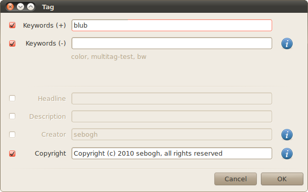

nautilusexif
============

Nautilus context menu for metadata (EXIF, IPTC, XMP) manipulation, using [exiftool](http://www.sno.phy.queensu.ca/~phil/exiftool/).

Install
-------
Ensure exiftool is installed:

    sudo apt-get install libimage-exiftool-perl

and place the script (`tag`) in `~/gnome2/nautilus-scripts`.

Screenshot
----------
